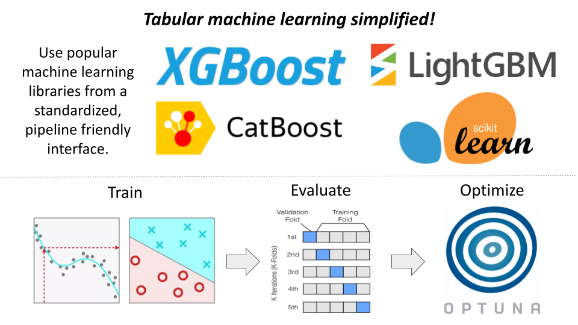

[](https://github.com/xaviernogueira/Tabular_ML/actions/workflows/pre-commit.yml)
[](https://github.com/xaviernogueira/Tabular_ML/actions/workflows/tests.yml)

# `tabular_ml` - tabular machine learning simplified!
I've packaged and open sourced my personal machine learning tools to speed up your next data science project.

Train, evaluate, ensemble, and optimize hyperparameters from a standardized interface.



## Key Features
* Train models efficiently without worrying about library differences! `tabular_ml` implements library specific, performance oriented, patterns/classes under-the-hood (i.e., `xgboost.DMatrix -> xgboost.Booster`).
* Automate the K-Fold evaluation process across multiple models simultaneously (including ensembles).
* Rapidly optimize hyperparameters using [`optuna`](https://optuna.org/). Leverage our built-in parameter search spaces, or adjust to your needs.
* Behavior you can trust long term. We use a type-checking "factory" design pattern and robust test suite to provide reliability as the library grows over time.


# Library Documentation

## Getting started
This library is available on PyPI and can be easily pip installed into your environment.
```
pip install tabular_ml
```
## Using models

### Explore model offerings
We use `tabular_ml.ModelFactory` to keep track of all supported regression and classification models. One can programmatically explore model offerings with the following functions:

```python
import tabular_ml

# to get a list of regression models
tabular_ml.ModelFactory.get_regression_models()

# to get a list of classification models
tabular_ml.ModelFactory.get_regression_models()

# get a dictionary storing both the above lists
tabular_ml.ModelFactory.get_all_models()
```

### `MLModel` objects
Each model registered to `ModelFactory` must be a concrete implementation of the `tabular_ml.base.MLModel` abstract base class. 

This means that all registered models contain the following functions allowing them to be used interchangeably:
```python
def train_model(
    x_train: pd.DataFrame,
    y_train: pd.Series,
    model_params: Dict[str, Any],
    weights_train: Optional[pd.Series] = None,
    categorical_features: Optional[List[str]] = None,
) -> object: # type depends on the specific model implementation
    """Train a model instance."""
    ...

def make_predictions(
    trained_model: object, # same as train_model() output!
    x_test: pd.DataFrame,
    categorical_features: Optional[List[str]] = None,
) -> np.ndarray:
    """Make predictions with a trained model instance."""
    ...

def train_and_predict(
    x_train: pd.DataFrame,
    y_train: pd.Series,
    x_test: pd.DataFrame,
    model_params: Dict[str, Any],
    weights_train: Optional[pd.Series] = None,
    categorical_features: Optional[List[str]] = None,
) -> Tuple[object, np.ndarray]:
    """Trains a model and makes predictions on param:x_test."""
    ...

def objective(
    trial: Trial,
    features: pd.DataFrame,
    target: pd.Series,
    kfolds: int,
    metric_function: callable,
    weights: Optional[pd.Series] = None,
    categorical_features: Optional[List[str]] = None,
    random_state: Optional[int] = None,
    custom_param_ranges: Optional[OptunaRangeDict] = None,
) -> float:
    """Controls optuna hyperparameter optimization behavior."""
    ...
```


### Currently supported models
**[`catboost`](https://catboost.ai/en/docs/)**
* `CatBoostRegressionModel`
* `CatBoostClassificationModel`

**[`xgboost`](https://xgboost.readthedocs.io/en/stable/python/index.html)**
* `XGBoostRegressionModel`

**[`lightgbm`](https://lightgbm.readthedocs.io/en/v3.3.2/)**
* `LightGBMRegressionModel`

**[`sklearn.linear_models`](https://scikit-learn.org/stable/modules/linear_model.html)**
* `LinearRegressionModel`
* `RidgeRegressionModel`
* `LassoRegressionModel`
* `ElasticNetRegressionModel`
* `BayesianRidgeRegressionModel`

## 

## Optimize hyperparameters

## Contribute
