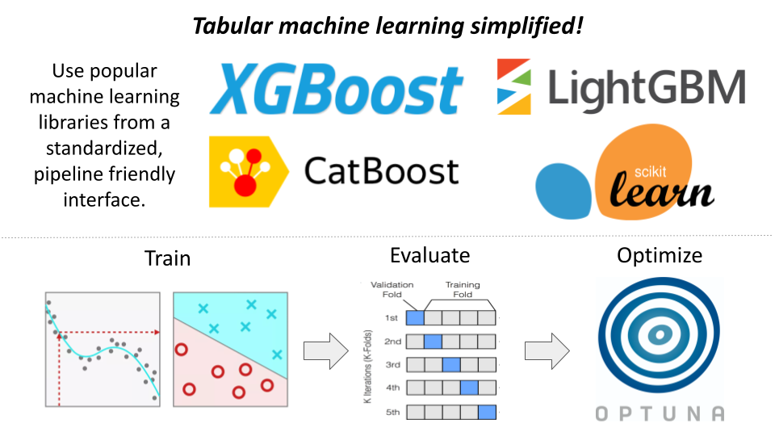

# `tabular_ml` - tabular machine learning simplified!
I've packaged and open sourced my personal machine learning tools to speed up your next data science project.

Train, evaluate, ensemble, and optimize hyperparameters from a standardized interface.

## Key Features
* Train models efficiently without worrying about library differences! `tabular_ml` implements library specific, performance oriented, patterns/classes under-the-hood (i.e., `xgboost.DMatrix -> xgboost.Booster`).
* Automate the K-Fold evaluation process across multiple models simultaneously (including ensembles).
* Rapidly optimize hyperparameters using [`optuna`](https://optuna.org/). Leverage our built-in parameter search spaces, or adjust to your needs.
* Plugin-able. Write your own plugins to extend functionality without forking (and consider contributing your plugins!).

**For full documentation see our GitHub ReadMe [here](https://github.com/xaviernogueira/Tabular_ML).**
